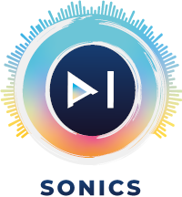

 

The AI-Sonics application is an automatic atmo generation tool for videofiles. 

##  Important 

The application is mainly tested on Windows with Visual Studio Code. It can be installed and used on MacOS, but error-free use cannot be guaranteed.
To run the application, it is recommended to use visual studio code and open the entire project folder via Visual studio code.

To setup AI-Sonics on your machine, follow these 3 easy steps:

## 1. Install Reaper
First install the DAW Reaper: https://www.reaper.fm/download.php 

In order to enable AI-Sonics to communicate with Reaper, Reaper must be connected to the selected Python interpreter and the Python-Reapy package.
This can be done automatically with step 3 via Setup.py or manually. However, since additional packages are required for the application and the whole application should run in an environment, the setup is preferred here.

The following points must be carried out for a manual connection:
<mark>Options > Preferences > Plug-ins > ReaScript</mark> : Check the box for 'Enable Python for use with ReaScript'. Browse for the path to your python directory and select the corresponding python.dll on Windows and python.dylib on MacOS. 
These can typically be found here:

Windows:    
```
C:\Users\Username\AppData\Local\Programs\Python\PythonXXX
```

MacOS:      
```
/Library/Frameworks/Python.framework/Versions/3.xx/lib/python3.xx/config-3.xx-darwin
```

When there are multiple versions in the same folder, you may have to use 'Force ReaScript to usse specific Python .dll'. Hit 'Apply' and 'Ok'. You may have to restart Reaper. Note: Does not work with Conda, use native Python.

Then reapy needs to be installed via Terminal with:

Windows:    
```bash
$ py -m pip install python-reapy 
```

MacOS:      
```bash
$ pip install python-reapy
```

In order to use the python package reapy, Reaper needs to know that reapy is available. Reaper must be started and the following command must then be executed via a terminal: 

Windows:
```bash
$ py -c "import reapy; reapy.configure_reaper()"
```

MacOS/Linux
```bash
$ python -c "import reapy; reapy.configure_reaper()"
```

After executing the terminal command, Reaper must be closed or restarted.

## 2. Install VST Plugins
To create the ambient mix, the IEM Plugin Suite is required, which can be downloaded via the URL: 
https://plugins.iem.at/

## 3. Execute Setup.py
Next execute the Setup.py file. It will locate the path of your Reaper installation (which is necessary for later steps) and install the requiered packages from the Requirement.txt file. In addition, an extra environment is created within the project folder, called "aisonic_environment". 
After the Setup.py has been successfully executed, the Python interpreter should be switched to the "aisonic_environment".

## 4. GUI.py
After installing all the required packages, you can start to launch the prototype. This can be done by executing the GUI.py file. It will launch a GUI, which will guide you through the steps necessary for creating atmo for your video.

## Troubleshooting

Despite the setup, it can happen that no connection can be established between Reaper and Reapy. Executing the reapy connection command again can result in error messages. In most cases, this error can only be resolved by resetting the Reaper config.
On Windows you search for "REAPER (x64) (reset configuration to factory defaults)" in the search bar.